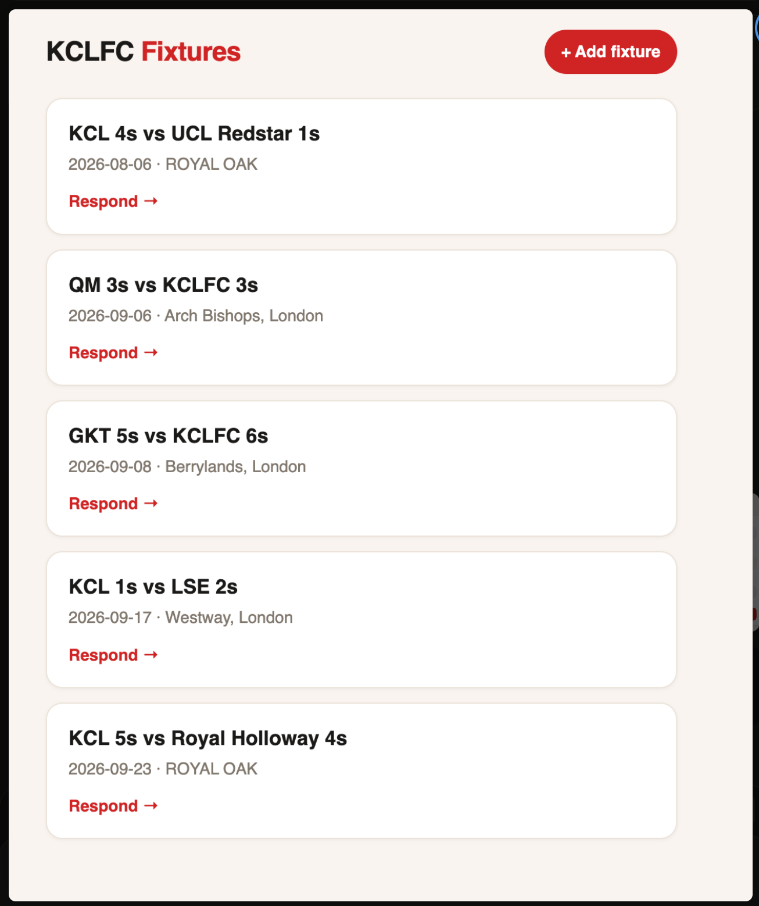

# KCLFC Availability Tracker

A web app for King's College London Football Club: captains post fixtures, players tap whether they're available, everyone sees who's coming — all from one shared link, no accounts needed.

**Live:** [gurikelani.pythonanywhere.com](https://gurikelani.pythonanywhere.com)



## Why

Match availability was being collected through group-chat replies that scrolled away and got lost. As VP of Finance on the club committee, I built this so a captain can post a fixture once and get a live list of who's in.

## Features

- **Fixtures feed** — upcoming games as cards, soonest first, each with date and location
- **One-tap responses** — players open the fixture, enter their name, pick Available / Not available
- **Change your mind safely** — resubmitting under the same name updates your answer instead of duplicating it, enforced at the database level with a `UNIQUE(fixture_id, player_name)` constraint and an upsert:

```sql
INSERT INTO responses (fixture_id, player_name, status) VALUES (?, ?, ?)
ON CONFLICT(fixture_id, player_name) DO UPDATE SET status = excluded.status
```

- **Mobile-first** — the club lives in a group chat, so the UI is built for phones

## Stack

Flask · SQLite · vanilla HTML/CSS (Jinja templates) · deployed on PythonAnywhere (WSGI) · versioned with Git

All SQL uses parameterised queries — no string-built statements anywhere.

## Schema

```
fixtures                     responses
--------                     ---------
id (PK)                      id (PK)
opponent                     fixture_id → fixtures.id
date                         player_name
location                     status ('yes' / 'no')
                             UNIQUE(fixture_id, player_name)
```

## Run locally

```bash
git clone https://github.com/gurikelani/availability-tracker.git
cd availability-tracker
python3 -m venv venv && source venv/bin/activate
pip install -r requirements.txt
python init_db.py
flask --app app run
```

Then open http://127.0.0.1:5000.

## Roadmap

- Captain view: delete fixtures and responses
- Availability counts on the fixture cards
- Tests (pytest) for the upsert and routes
